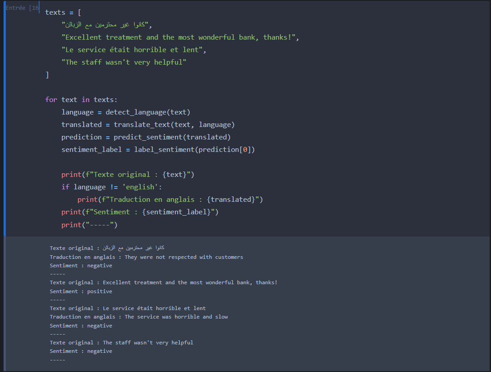
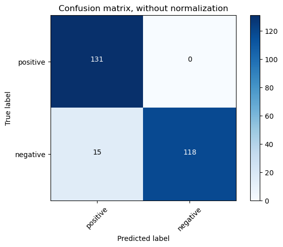

# 🏦 Bank Comments Sentiment Analysis

## 📌 Project Overview
This project focuses on **sentiment analysis** of bank-related comments, classifying them as **Positive** or **Negative**. We leverage a **Pegasus Paraphraser** to augment the dataset by generating paraphrased versions of comments, followed by extensive preprocessing, training multiple machine learning models, and evaluating their performance on multilingual comments (English, Arabic, French). The goal is to accurately predict the sentiment of customer feedback about banking services.

---

## 📂 Dataset Sources
### 1. Initial Dataset
- **Positive Comments**: Sourced from `positive_sa.csv` and `positive_safinal2.csv`, containing positive reviews about banking services.
- **Negative Comments**: Sourced from `negative_sa.csv` and `negative_safinal2.csv`, containing negative reviews about banking services.

### 2. Augmented Dataset
- Using the **Pegasus Paraphraser** model (`tuner007/pegasus_paraphrase`), we generate multiple paraphrased versions of each comment to enrich the dataset.

---

## 🔍 Project Workflow

### **1. Data Augmentation with Pegasus Paraphraser**
We use the Pegasus model to paraphrase comments, increasing the dataset size and diversity.

```python
from transformers import PegasusForConditionalGeneration, PegasusTokenizer
import torch

model_name = 'tuner007/pegasus_paraphrase'
torch_device = 'cuda' if torch.cuda.is_available() else 'cpu'
tokenizer = PegasusTokenizer.from_pretrained(model_name)
model = PegasusForConditionalGeneration.from_pretrained(model_name).to(torch_device)

def get_response(input_text, num_return_sequences, num_beams):
    batch = tokenizer([input_text], truncation=True, padding='longest', max_length=60, return_tensors="pt").to(torch_device)
    translated = model.generate(**batch, max_length=60, num_beams=num_beams, num_return_sequences=num_return_sequences, temperature=1.5)
    tgt_text = tokenizer.batch_decode(translated, skip_special_tokens=True)
    return tgt_text

num_beams = 10
num_return_sequences = 10
response = get_response("the most wonderful bank, excellent treatment", num_return_sequences, num_beams)
```

The paraphrased comments are appended to the original dataset and saved as `positive_safinal.csv` and `negative_safinal.csv`.

### **2. Data Cleaning & Preprocessing**
We preprocess the comments to ensure consistency:
- Convert text to lowercase
- Remove URLs, HTML tags, punctuation, numbers, and special characters
- Remove line breaks and specific HTML entities
- Remove stopwords and apply lemmatization using NLTK's `WordNetLemmatizer`

```python
import re
import string
from nltk.stem import WordNetLemmatizer

stop_words = ['yourselves', 'between', 'whom', 'itself', 'is', "she's", 'up', 'herself', 'here', 'your', 'each', 
              'we', 'he', 'my', "you've", 'having', 'in', 'both', 'for', 'themselves', 'are', 'them', 'other',
              'and', 'an', 'during', 'their', 'can', 'yourself', 'she', 'until', 'so', 'these', 'ours', 'above', 
              'what', 'while', 'have', 're', 'more', 'only', "needn't", 'when', 'just', 'that', 'were',  
              'very', 'should', 'any', 'y', 'isn', 'who',  'a', 'they', 'to', 'too', "should've", 'has', 'before',
              'into', 'yours', "it's", 'do', 'against', 'on',  'now', 'her', 've', 'd', 'by', 'am', 'from', 
              'about', 'further', "that'll", "you'd", 'you', 'as', 'how', 'been', 'the', 'or', 'doing', 'such',
              'his', 'himself', 'ourselves',  'was', 'through', 'out', 'below', 'own', 'myself', 'theirs', 
              'me', 'why', 'once',  'him', 'than', 'be', 'most', "you'll", 'same', 'some', 'with', 'few', 'it',
              'at', 'after', 'its', 'which', 'there','our', 'this', 'hers', 'being', 'did', 'of', 'had', 'under',
              'over','again', 'where', 'those', 'then', "you're", 'i', 'because', 'does', 'all']

def review_cleaning(text):
    text = str(text).lower()
    text = re.sub('\[.*?\]', ' ', text)
    text = re.sub('https?://\S+|www\.\S+', ' ', text)
    text = re.sub('<.*?>+', '', text)
    text = re.sub('[%s]' % re.escape(string.punctuation), ' ', text)
    text = re.sub('\n', ' ', text)
    text = re.sub('\w*\d\w*', ' ', text)
    text = re.sub("<[a][^>]*>(.+?)</[a]>", 'Link.', text)
    text = re.sub('&gt;', " ", text)
    text = re.sub('&#x27;', "'", text)
    text = re.sub('&#x2F;', ' ', text)
    text = re.sub('<p>', ' ', text)
    text = re.sub('<i>', ' ', text)
    text = re.sub('</i>', ' ', text)
    text = re.sub('&#62;', ' ', text)
    text = re.sub("\n", ' ', text)
    return text

ps = WordNetLemmatizer()
corpus = []
for review in df['review']:
    review = review_cleaning(review)
    review = re.sub('[^a-zA-Z]', ' ', review)
    review = review.split()
    review = [ps.lemmatize(word) for word in review if word not in stop_words]
    review = ' '.join(review)
    corpus.append(review)
```

### **3. Model Training**
We train multiple classifiers to identify the best-performing model:
- **Logistic Regression**
- **Decision Tree**
- **Naive Bayes (BernoulliNB)**

The dataset is vectorized using **TfidfVectorizer** with bigrams and balanced using **SMOTE** to address class imbalance. The models are evaluated using 10-fold cross-validation, and the best model is selected based on accuracy.

```python
from sklearn.feature_extraction.text import TfidfVectorizer
from sklearn.model_selection import train_test_split, cross_val_score
from sklearn.linear_model import LogisticRegression
from sklearn.tree import DecisionTreeClassifier
from sklearn.naive_bayes import BernoulliNB
from imblearn.over_sampling import SMOTE
import joblib
import pickle

tfidf_vectorizer = TfidfVectorizer(max_features=350, ngram_range=(2,2))
X = tfidf_vectorizer.fit_transform(corpus)
y = df['sentiment']

smote = SMOTE(random_state=42)
X_res, y_res = smote.fit_resample(X, y)

X_train, X_test, y_train, y_test = train_test_split(X_res, y_res, test_size=0.30, random_state=0)

cv_models = [
    LogisticRegression(random_state=0),
    DecisionTreeClassifier(),
    BernoulliNB()
]
cv_dict = {0: 'Logistic Regression', 1: 'Decision Tree', 2: 'Naive Bayes'}

best_accuracy = 0
best_model = None
best_model_name = ""

for i, model in enumerate(cv_models):
    accuracy = cross_val_score(model, X, y, cv=10, scoring='accuracy').mean()
    print(f"{cv_dict[i]} Test Accuracy: {accuracy:.4f}")
    if accuracy > best_accuracy:
        best_accuracy = accuracy
        best_model = model
        best_model_name = cv_dict[i]

best_model.fit(X_train, y_train)
y_pred_best = best_model.predict(X_test)

# Save the vectorizer and model
pickle.dump(tfidf_vectorizer, open("banksatfidf_vectorizer2.pkl", "wb"))
joblib.dump(best_model, "Bankmodel_Sentiment_Analysis_classification.sav")
```

### **4. Model Evaluation**
The best model is evaluated using accuracy, precision, recall, and F1-score. A confusion matrix is generated to visualize performance.

```python
from sklearn.metrics import accuracy_score, precision_score, recall_score, f1_score, confusion_matrix
import matplotlib.pyplot as plt
import numpy as np

accuracy = accuracy_score(y_test, y_pred_best)
precision = precision_score(y_test, y_pred_best)
recall = recall_score(y_test, y_pred_best)
f1 = f1_score(y_test, y_pred_best)

print("Accuracy: {:.2f}%".format(accuracy * 100))
print("Precision: {:.2f}%".format(precision * 100))
print("Recall: {:.2f}%".format(recall * 100))
print("F1 score: {:.2f}%".format(f1 * 100))

def plot_confusion_matrix(cm, classes, title='Confusion matrix', cmap=plt.cm.Blues):
    plt.imshow(cm, interpolation='nearest', cmap=cmap)
    plt.title(title)
    plt.colorbar()
    tick_marks = np.arange(len(classes))
    plt.xticks(tick_marks, classes, rotation=45)
    plt.yticks(tick_marks, classes)
    thresh = cm.max() / 2.
    for i in range(cm.shape[0]):
        for j in range(cm.shape[1]):
            plt.text(j, i, cm[i, j], horizontalalignment="center", color="white" if cm[i, j] > thresh else "black")
    plt.tight_layout()
    plt.ylabel('True label')
    plt.xlabel('Predicted label')
    plt.savefig('matrix.png')

cnf_matrix = confusion_matrix(y_test, y_pred_best)
plot_confusion_matrix(cnf_matrix, classes=['positive', 'negative'])
```

### **5. Visualization**
We visualize the dataset and model performance using:
- **Word Clouds**: To display frequent words in positive and negative reviews.
- **Bar Charts**: To show frequent unigrams and bigrams for positive and negative reviews.
- **Test Results**: Example predictions on multilingual comments (saved as `test.png`).
- **Confusion Matrix**: To evaluate model performance (saved as `matrix.png`).

```python
from wordcloud import WordCloud
import plotly.graph_objs as go
from plotly import tools

# Word cloud for positive reviews
text = df[df['sentiment'] == 1]['review']
wordcloud = WordCloud(width=3000, height=2000, background_color='black', stopwords=stop_words).generate(str(text))
plt.figure(figsize=(40, 30), facecolor='k', edgecolor='k')
plt.imshow(wordcloud, interpolation='bilinear')
plt.axis('off')
plt.tight_layout(pad=0)
plt.savefig('positive_wordcloud.png')
plt.close()

# Word cloud for negative reviews
text = df[df['sentiment'] == 0]['review']
wordcloud = WordCloud(width=3000, height=2000, background_color='black', stopwords=stop_words).generate(str(text))
plt.figure(figsize=(40, 30), facecolor='k', edgecolor='k')
plt.imshow(wordcloud, interpolation='bilinear')
plt.axis('off')
plt.tight_layout(pad=0)
plt.savefig('negative_wordcloud.png')
plt.close()
```

---

## 📊 Model Results
### Test Results


### Confusion Matrix


---

## 📦 Requirements
Install the required Python packages:

```bash
pip install pandas numpy sentence-splitter transformers SentencePiece torch googletrans langdetect nltk scikit-learn joblib imblearn wordcloud plotly matplotlib
```

---

## ▶️ How to Run
1. Clone this repository:
   ```bash
   git clone https://github.com/ali27kh/Bank_Sentiment_Analysis.git
   cd Bank_Sentiment_Analysis
   ```
2. Place `positive_sa.csv`, `positive_safinal2.csv`, `negative_sa.csv`, and `negative_safinal2.csv` in the project folder.
3. Install dependencies (see Requirements section).
4. Open and edit the ipynb files (according to your needs).

---

## 📌 Key Insights
- The **Pegasus Paraphraser** significantly enhances dataset diversity by generating varied comment phrasings.
- **SMOTE** effectively balances the dataset, improving model performance on minority classes.
- The best model (often **Logistic Regression**) achieves high accuracy, precision, recall, and F1-score, as shown in the confusion matrix.
- Positive comments frequently mention excellent customer service, while negative comments often highlight slow or unhelpful service.
- Word clouds and bigram plots reveal key themes, such as "great service" in positive reviews and "poor support" in negative reviews.

---

## 📜 License
This project is open-source under the MIT License.
